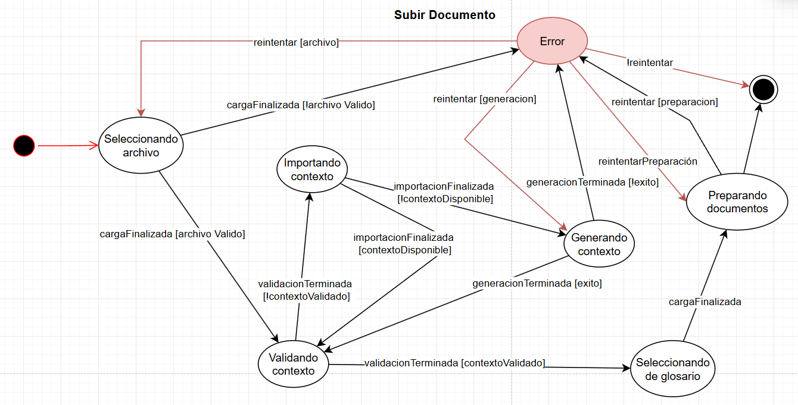
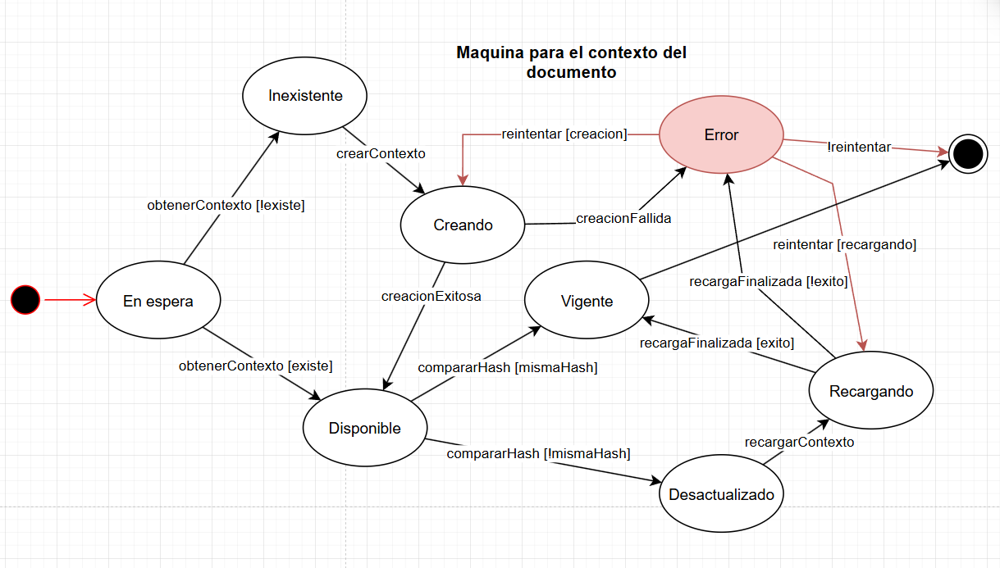
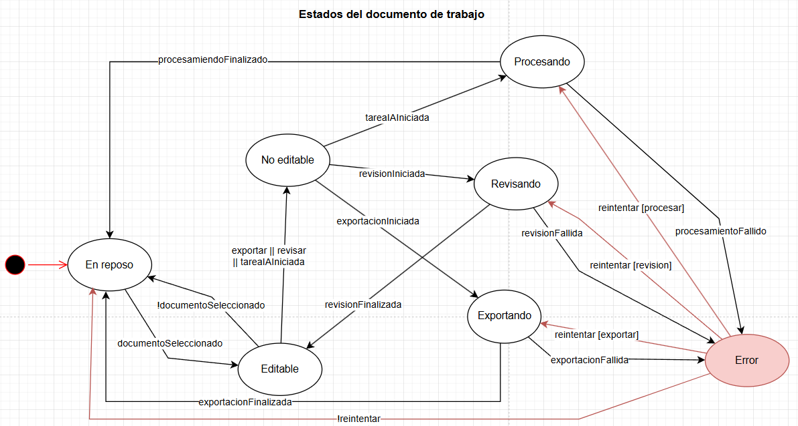
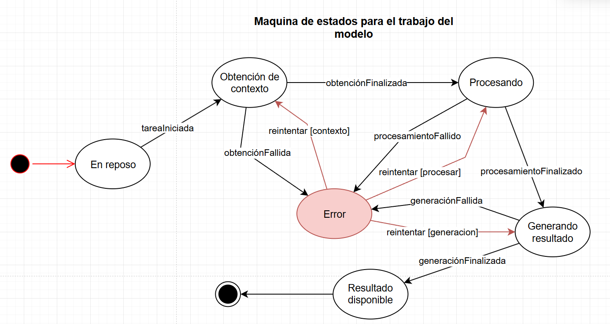
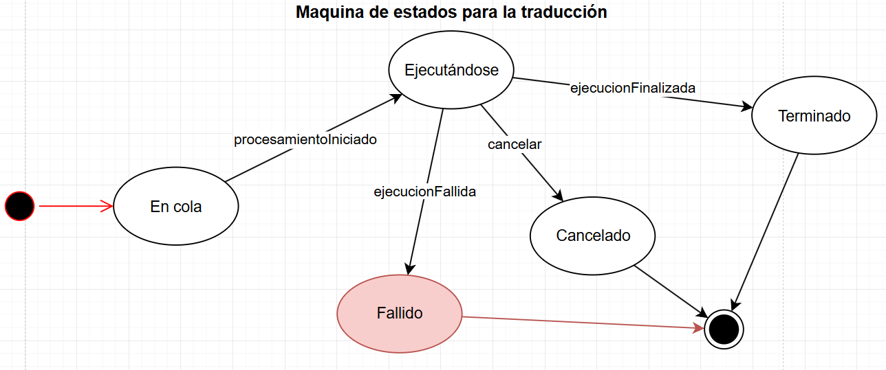

# Máquinas de Estado del Sistema

## Estado
Borrador

## Owner
T2 — Bruno (Tech Lead / Sistemas)
---

# Objetivo general

Describir de manera integrada las principales **máquinas de estado** que modelan el comportamiento dinámico del sistema.

El sistema corresponde a una plataforma SaaS orientada a **asistir procesos de traducción y revisión de documentos mediante inteligencia artificial**, donde una parte importante del procesamiento sensible ocurre de forma local para preservar privacidad y reducir exposición de información confidencial.

Este documento unifica en una sola estructura las máquinas de estado principales del sistema, evitando tratarlas como documentos aislados y mostrando con mayor claridad cómo se relacionan entre sí dentro del flujo general de trabajo. Aun así, se conserva el detalle funcional de cada máquina, incluyendo sus **estados**, **transiciones**, **casos alternativos** y **manejo de errores**.

Las máquinas aquí descritas son las siguientes:

- **Subir documento**
- **Contexto del documento**
- **Documento de trabajo**
- **Trabajo del modelo**
- **Traducción**

---

# Contexto general del flujo

En términos globales, el sistema sigue una secuencia lógica de trabajo:

1. un documento es cargado y preparado para su uso dentro de la plataforma
2. se verifica si existe un contexto reutilizable o si debe generarse uno nuevo
3. el documento entra al entorno de trabajo y alterna entre estados editables y bloqueados según las operaciones activas
4. el modelo de IA ejecuta tareas generales de procesamiento a partir de contexto y entradas disponibles
5. algunas de esas tareas corresponden específicamente al flujo de traducción

De esta manera, las máquinas de estado no operan de manera aislada, sino que representan **distintas capas del mismo proceso operativo**.

---

# Relación entre las máquinas de estado

A nivel funcional, la relación entre las máquinas puede entenderse de la siguiente forma:

| Máquina | Función principal | Relación con las demás |
|---|---|---|
| **Subir documento** | Controla la carga inicial del archivo y su preparación | Es la puerta de entrada al flujo completo |
| **Contexto del documento** | Gestiona existencia, vigencia y recarga del contexto semántico | Alimenta al documento de trabajo y al modelo |
| **Documento de trabajo** | Controla cuándo el documento puede o no editarse | Coordina revisión, procesamiento IA y exportación |
| **Trabajo del modelo** | Modela el ciclo general de una tarea de IA | Provee resultados que pueden usarse en revisión, traducción u otras funciones |
| **Traducción** | Modela el ciclo específico de una tarea de traducción | Puede considerarse una instancia especializada de trabajo del modelo |

Esta separación permite describir el comportamiento del sistema de forma modular, sin perder de vista que todas las máquinas participan en un mismo ecosistema de operación.

---

# Resumen de estados por máquina

## Subir documento

| Estado | Función |
|---|---|
| **Seleccionando archivo** | Permite elegir y cargar el archivo inicial |
| **Validando contexto** | Verifica si el documento posee contexto reutilizable y válido |
| **Importando contexto** | Intenta recuperar un contexto existente |
| **Generando contexto** | Construye un nuevo contexto si no existe uno válido |
| **Seleccionando de glosario** | Permite escoger terminología especializada |
| **Preparando documento** | Inicializa el entorno final de trabajo |
| **Error** | Centraliza fallos durante carga, importación, generación o preparación |

## Contexto del documento

| Estado | Función |
|---|---|
| **En espera** | Punto de entrada para buscar contexto |
| **Inexistente** | No existe contexto asociado |
| **Creando** | Se genera contexto desde cero |
| **Disponible** | El contexto existe, pero aún no se valida contra la versión actual |
| **Vigente** | El contexto existe y fue validado como correcto |
| **Desactualizado** | El contexto ya no coincide con la versión actual del documento |
| **Recargando** | El contexto se reconstruye o actualiza |
| **Error** | Maneja fallos de creación o recarga |

## Documento de trabajo

| Estado | Función |
|---|---|
| **En reposo** | Punto de entrada y retorno del documento |
| **Editable** | El usuario puede modificar el documento |
| **No editable** | El documento se bloquea por una operación sensible |
| **Revisando** | Se ejecuta revisión asistida |
| **Procesando** | Se ejecuta una tarea general de IA sobre el documento |
| **Exportando** | Se exporta el documento |
| **Error** | Maneja fallos operativos con reintentos |

## Trabajo del modelo

| Estado | Función |
|---|---|
| **En reposo** | Estado inicial sin tarea activa |
| **Obtención de contexto** | Reúne información necesaria para la tarea |
| **Procesando** | Ejecuta la operación principal del modelo |
| **Generando resultado** | Consolida y estructura la salida |
| **Resultado disponible** | El resultado ya puede ser consumido por el sistema |
| **Error** | Centraliza fallos por etapa |

## Traducción

| Estado | Función |
|---|---|
| **En cola** | La tarea existe, pero aún no se ejecuta |
| **Ejecutándose** | La traducción se encuentra en procesamiento |
| **Terminado** | La traducción concluyó correctamente |
| **Cancelado** | La traducción fue detenida antes de completarse |
| **Fallido** | La traducción terminó con error |

---

# 1. Máquina de Estados — Subir Documento

## Propósito dentro del sistema

Esta máquina modela el flujo de **ingreso inicial del documento** a la plataforma y su preparación operativa antes de entrar al entorno de trabajo.

El flujo contempla:

- validación del archivo cargado
- reutilización de contexto previamente generado
- generación de contexto cuando no existe uno válido
- selección de glosario
- preparación final del documento para edición o traducción

Su función es asegurar que el documento solo acceda al espacio de trabajo cuando toda la información necesaria haya sido resuelta correctamente.

## Relación funcional de la máquina

La lógica central de esta máquina consiste en que un archivo no debe pasar directamente del acto de carga a la edición. Antes de ello, el sistema debe decidir si puede reutilizar un contexto existente, si debe construir uno nuevo, si debe aplicar un glosario técnico y si ya cuenta con condiciones mínimas para abrir el documento en el entorno de trabajo.

Por ello, esta máquina funciona como **filtro y preparación previa** para el resto del sistema.

## Estados

### 1. Seleccionando archivo
Estado inicial del flujo.

El usuario selecciona un archivo desde su sistema local para cargarlo en la plataforma.

El sistema espera la finalización del proceso de carga del archivo.

**Transiciones posibles:**

- `cargaFinalizada [archivoValido]`
- `cargaFinalizada [!archivoValido]`

Si el archivo es válido, el flujo continúa hacia **Validando contexto**.  
Si el archivo no es válido, el sistema transiciona al estado **Error**.

---

### 2. Validando contexto
Una vez cargado el archivo, el sistema verifica si existe un **contexto previamente generado** asociado al documento.

Esta validación puede implicar:

- comparación de hash del documento
- verificación de integridad del contexto exportado
- compatibilidad entre documento y contexto

**Transiciones posibles:**

- `validacionTerminada [contextoValidado]`
- `validacionTerminada [!contextoValidado]`

Si el contexto es válido, el flujo continúa hacia **Seleccionando de glosario**.  
Si no lo es, el sistema intenta recuperar o generar un nuevo contexto.

---

### 3. Importando contexto
En este estado el sistema intenta **cargar un contexto previamente exportado** asociado al documento.

Este mecanismo permite reutilizar información previamente procesada y evitar el uso innecesario del modelo de IA.

**Transiciones posibles:**

- `importacionFinalizada [contextoDisponible]`
- `importacionFinalizada [!contextoDisponible]`

Si el contexto importado está disponible, se continúa con la validación del mismo en **Validando contexto**.  
Si no existe o no está disponible, se procede a **Generando contexto**.

---

### 4. Generando contexto
Cuando no existe contexto disponible o válido, el sistema genera uno nuevo.

Este proceso puede incluir:

- análisis del documento
- fragmentación del contenido
- generación de embeddings
- construcción del índice de contexto

**Transiciones posibles:**

- `generacionTerminada [exito]`
- `generacionTerminada [fallo]`

Si la generación es exitosa, se retorna a **Validando contexto** para confirmar su validez.  
Si ocurre un fallo, se transiciona al estado **Error**.

---

### 5. Seleccionando de glosario
Una vez confirmado que existe un contexto válido, el usuario puede seleccionar un **glosario técnico** que será utilizado durante el proceso de traducción o revisión.

El glosario permite definir terminología específica que debe respetarse durante el procesamiento del documento.

**Transición posible:**

- `cargaFinalizada`

Al completarse la selección, el sistema procede a **Preparando documento**.

---

### 6. Preparando documento
En este estado el sistema inicializa el espacio de trabajo del documento.

Esto puede implicar:

- inicializar estructuras internas
- cargar contexto en memoria
- aplicar glosario seleccionado
- preparar el documento para edición o traducción

**Transición posible:**

- `preparacionTerminada`

Al finalizar este proceso, el documento queda listo para comenzar el flujo principal de trabajo.

---

### 7. Error
Estado al que se transiciona cuando ocurre un fallo durante:

- carga de archivo
- importación de contexto
- generación de contexto
- preparación del documento

Desde este estado el sistema permite **reintentar ciertas operaciones** dependiendo de la etapa en la que ocurrió el fallo.

**Transiciones posibles:**

- `reintentarGeneracion`
- `reintentarPreparacion`

Estas transiciones permiten retomar el flujo sin reiniciar completamente el proceso.

## Estado inicial

El estado inicial de la máquina es:
**Seleccionando archivo**

## Estado final

La máquina alcanza su estado final cuando el documento ha sido preparado correctamente y está listo para utilizarse dentro del sistema.

Este estado representa la finalización del proceso de carga y preparación del documento.

## Flujo principal resumido

**Seleccionando archivo**  
→ **Validando contexto**  
→ (**Importando contexto** | **Generando contexto**)  
→ **Validando contexto**  
→ **Seleccionando de glosario**  
→ **Preparando documento**  
→ **Final**

Este flujo garantiza que el documento siempre cuente con un **contexto válido** y con las **configuraciones necesarias** antes de entrar al entorno de trabajo.

---

# 2. Máquina de Estados — Contexto del Documento

## Propósito dentro del sistema

Esta máquina modela el comportamiento del **contexto semántico asociado al documento**.

Su función es asegurar que el sistema utilice únicamente un contexto consistente con la versión vigente del documento antes de emplearlo en tareas como traducción, revisión o análisis asistido por IA.

## Consideración semántica de los estados

Para evitar ambigüedad entre algunos estados, se establece la siguiente diferencia conceptual:

- **Disponible**: indica que el contexto **existe y puede recuperarse**, pero aún no se ha confirmado si corresponde exactamente a la versión actual del documento.
- **Vigente**: indica que el contexto, además de existir, **ya fue validado** y corresponde a la versión actual del documento.
- **Desactualizado**: indica que el contexto existe, pero **ya no coincide** con la versión actual del documento, por lo que requiere recarga o regeneración.

Esta distinción es importante porque un contexto puede estar almacenado y ser accesible, pero no necesariamente seguir siendo válido tras modificaciones al documento fuente.

## Validación mediante hash

La transición `compararHash` representa la verificación entre el identificador hash del documento actual y el hash asociado al contexto almacenado.

Esta comparación permite determinar si el contexto sigue siendo válido para la versión actual del documento:

- si ambos hashes coinciden, el contexto se considera **vigente**
- si los hashes no coinciden, el contexto se considera **desactualizado**

De esta forma, el sistema puede detectar cambios entre versiones del documento y decidir si debe reutilizar el contexto existente o recargarlo.

## Relación funcional de la máquina

La máquina distingue entre tres situaciones fundamentales:

1. **no existe contexto**
2. **existe contexto, pero aún no se ha validado**
3. **existe contexto y ya fue verificado como correspondiente a la versión actual**

A partir de esa lógica, el sistema puede decidir si debe crear contexto desde cero, validarlo o regenerarlo.

## Estados

### 1. En espera
Estado inicial del flujo.

Representa el punto en el que el sistema aún no ha determinado si existe un contexto asociado al documento actual.

Desde este estado se intenta obtener el contexto almacenado.

**Transiciones posibles:**

- `obtenerContexto [existe]`
- `obtenerContexto [!existe]`

Si existe contexto, la máquina transiciona a **Disponible**.  
Si no existe, la máquina transiciona a **Inexistente**.

---

### 2. Inexistente
Representa la ausencia de un contexto asociado al documento.

En este estado el sistema reconoce que no hay información contextual previamente almacenada y, por tanto, debe iniciar su creación.

**Transición posible:**

- `crearContexto`

Cuando se inicia la creación del contexto, la máquina transiciona a **Creando**.

---

### 3. Creando
Representa el proceso de generación inicial del contexto del documento.

Aquí el sistema puede ejecutar tareas como análisis del contenido, segmentación, indexación semántica o construcción de estructuras auxiliares para su posterior uso.

**Transiciones posibles:**

- `creacionExitosa`
- `creacionFallida`

Si la creación finaliza correctamente, la máquina transiciona a **Disponible**.  
Si la creación falla, la máquina transiciona a **Error**.

---

### 4. Disponible
Representa un contexto que ya existe y puede recuperarse, pero que aún no ha sido validado contra la versión actual del documento.

Este estado funciona como punto previo a la validación de vigencia.

**Transiciones posibles:**

- `compararHash [mismaHash]`
- `compararHash [!mismaHash]`

Si el hash coincide, la máquina transiciona a **Vigente**.  
Si el hash no coincide, la máquina transiciona a **Desactualizado**.

---

### 5. Vigente
Representa un contexto existente y validado como correcto para la versión actual del documento.

Este es el estado deseable para utilizar el contexto dentro de procesos posteriores del sistema, ya que garantiza consistencia entre el documento y la información contextual asociada.

Desde este estado, la máquina puede considerarse finalizada para este flujo.

---

### 6. Desactualizado
Representa un contexto existente que ya no coincide con la versión actual del documento.

Esto implica que el documento fue modificado o que el hash asociado al contexto ya no corresponde al contenido actual, por lo que el contexto no debe utilizarse sin antes actualizarse.

**Transición posible:**

- `recargarContexto`

Cuando se inicia la recarga, la máquina transiciona a **Recargando**.

---

### 7. Recargando
Representa el proceso de actualización o regeneración del contexto para adaptarlo a la versión actual del documento.

Este estado contempla los casos en los que existe un contexto previo, pero este debe reconstruirse debido a cambios detectados en el documento.

**Transiciones posibles:**

- `recargaFinalizada [exito]`
- `recargaFinalizada [!exito]`

Si la recarga finaliza correctamente, la máquina transiciona a **Vigente**.  
Si la recarga falla, la máquina transiciona a **Error**.

---

### 8. Error
Representa un fallo durante la creación o recarga del contexto.

Desde este estado el sistema puede permitir reintentos dependiendo de la operación que produjo el error.

**Transiciones posibles:**

- `reintentar [creacion]`
- `reintentar [recargando]`
- `!reintentar`

Si se reintenta la creación, la máquina vuelve a **Creando**.  
Si se reintenta la recarga, la máquina vuelve a **Recargando**.  
Si no se reintenta, la máquina transiciona al estado final.

## Estado inicial

El estado inicial de la máquina es:
**En espera**

## Estado final

La máquina alcanza su estado final cuando:

- el contexto ha sido validado como **vigente**, o
- ocurre un error y no se realiza ningún reintento

## Flujo principal resumido

**En espera**  
→ (**Disponible** | **Inexistente**)  
→ **Creando** *(si no existe)*  
→ **Disponible**  
→ `compararHash`  
→ (**Vigente** | **Desactualizado**)  
→ **Recargando** *(si está desactualizado)*  
→ **Vigente**

Este flujo garantiza que el sistema solo trabaje con un contexto existente y consistente con la versión actual del documento.

---

# 3. Máquina de Estados — Documento de Trabajo

## Propósito dentro del sistema

Esta máquina modela el comportamiento operativo del **documento dentro del entorno de trabajo**.

Su función es controlar en qué momentos el documento puede ser modificado directamente por el usuario y en qué momentos debe permanecer protegido para garantizar consistencia durante operaciones sensibles del sistema.

## Relación entre los estados principales

La máquina gira alrededor de dos estados clave:

- **Editable**: el documento puede modificarse directamente.
- **No editable**: el documento no puede modificarse porque se encuentra bloqueado por una condición operativa del sistema.

A partir de estos estados, el documento puede entrar en procesos específicos:

- **Revisando**, cuando se ejecuta una revisión asistida.
- **Procesando**, cuando se ejecuta una tarea general de IA sobre el documento.
- **Exportando**, cuando el documento se encuentra en proceso de exportación.
- **Error**, cuando alguna de estas operaciones falla.
- **En reposo**, como estado de entrada y retorno general del flujo.

En términos funcionales, **Editable** representa el modo normal de interacción del usuario, mientras que **No editable** representa un estado de protección previa antes de iniciar tareas que requieren bloquear temporalmente el documento.

## Estados

### 1. En reposo
Estado inicial del flujo.

Representa el punto en el que no existe una operación activa sobre el documento y el sistema se encuentra a la espera de que se seleccione uno para trabajar.

Desde este estado, el flujo puede avanzar hacia edición si existe un documento seleccionado.

**Transiciones posibles:**

- `documentoSeleccionado`
- `!documentoSeleccionado`

Si el documento es seleccionado, la máquina transiciona a **Editable**.  
Si no existe documento seleccionado, el flujo permanece en este estado.

---

### 2. Editable
Representa un documento habilitado para edición directa.

En este estado el usuario puede escribir, modificar o ajustar el contenido del documento dentro del espacio de trabajo. Este es el estado operativo normal cuando no existe una restricción activa.

**Transiciones posibles:**

- `exportar || revisar || tareaIAIniciada`
- `revisionFinalizada`
- `documentoSeleccionado`

Cuando alguna de las operaciones `exportar`, `revisar` o `tareaIAIniciada` se inicia, la máquina transiciona a **No editable**, ya que el documento debe bloquearse antes de entrar al procesamiento correspondiente.

La transición `revisionFinalizada` devuelve el documento al modo editable tras concluir la revisión.  
La transición `documentoSeleccionado` mantiene o restablece la interacción directa con el documento dentro del espacio de trabajo.

---

### 3. No editable
Representa un documento bloqueado para edición.

Este estado impide modificaciones directas sobre el documento mientras se prepara o ejecuta una operación sensible. Su función es proteger la consistencia del contenido mientras el sistema realiza revisión, procesamiento o exportación.

**Transiciones posibles:**

- `revisionIniciada`
- `tareaIAIniciada`
- `exportacionIniciada`

Si se inicia una revisión, la máquina transiciona a **Revisando**.  
Si se inicia una tarea general de IA, la máquina transiciona a **Procesando**.  
Si se inicia la exportación, la máquina transiciona a **Exportando**.

---

### 4. Revisando
Representa el estado en el que el documento está siendo sometido a una operación de revisión asistida.

Durante este proceso, el documento permanece fuera del modo de edición directa para evitar inconsistencias entre el contenido visible y el resultado generado por el sistema.

**Transiciones posibles:**

- `revisionFinalizada`
- `revisionFallida`

Si la revisión finaliza correctamente, la máquina transiciona a **Editable**.  
Si la revisión falla, la máquina transiciona a **Error**.

---

### 5. Procesando
Representa la ejecución de una tarea de IA aplicada al documento.

Este estado modela operaciones como procesamiento de traducción u otras tareas automáticas que requieren bloquear temporalmente la edición mientras el sistema trabaja sobre el contenido.

**Transiciones posibles:**

- `procesamientoFinalizado`
- `procesamientoFallido`

Si el procesamiento concluye correctamente, la máquina transiciona a **En reposo**.  
Si el procesamiento falla, la máquina transiciona a **Error**.

---

### 6. Exportando
Representa el proceso de exportación del documento.

En este estado el sistema genera la salida correspondiente del documento y mantiene bloqueada su edición hasta que la operación termine.

**Transiciones posibles:**

- `exportacionFinalizada`
- `exportacionFallida`

Si la exportación concluye correctamente, la máquina transiciona a **En reposo**.  
Si la exportación falla, la máquina transiciona a **Error**.

---

### 7. Error
Representa un fallo ocurrido durante una operación de revisión, procesamiento o exportación.

Este estado concentra los errores operativos del documento de trabajo y permite decidir si el sistema debe reintentar la operación fallida o abandonar el flujo actual.

**Transiciones posibles:**

- `reintentar [revision]`
- `reintentar [procesar]`
- `reintentar [exportar]`
- `!reintentar`

Si se reintenta la revisión, la máquina vuelve a **Revisando**.  
Si se reintenta el procesamiento, la máquina vuelve a **Procesando**.  
Si se reintenta la exportación, la máquina vuelve a **Exportando**.  
Si no se realiza reintento, la máquina transiciona a **En reposo**.

## Estado inicial

El estado inicial de la máquina es:
**En reposo**

## Estado final

Esta máquina no representa un cierre definitivo del documento, sino su comportamiento operativo dentro del entorno de trabajo.

Por ello, el flujo normalmente retorna a **En reposo** cuando una operación concluye o cuando se abandona un error sin reintento.

## Flujo general

**En reposo**  
→ **Editable**  
→ **No editable**  
→ (**Revisando** | **Procesando** | **Exportando**)  
→ (**Editable** | **En reposo** | **Error**)

Si ocurre un error:

**Error**  
→ (**Revisando** | **Procesando** | **Exportando** | **En reposo**)

Este flujo garantiza que el documento solo pueda editarse cuando no existe una operación crítica en curso, y que cualquier tarea de revisión, procesamiento o exportación se ejecute con el documento temporalmente protegido.

## Relación funcional resumida

En términos funcionales, la relación entre los estados puede entenderse así:

- **En reposo** actúa como punto de entrada y retorno general.
- **Editable** representa el modo normal de trabajo del usuario.
- **No editable** actúa como mecanismo de bloqueo previo a tareas sensibles.
- **Revisando**, **Procesando** y **Exportando** representan operaciones activas sobre el documento.
- **Error** centraliza los fallos y habilita reintentos controlados.

De esta manera, la máquina permite mantener coherencia entre la edición manual del documento y las operaciones automáticas ejecutadas por el sistema.

---

# 4. Máquina de Estados — Trabajo del Modelo

## Propósito dentro del sistema

Esta máquina modela el flujo de **trabajo general del modelo de inteligencia artificial** dentro del sistema.

Su propósito es representar de forma general el ciclo operativo de las tareas ejecutadas por el modelo, independientemente de si estas corresponden a traducción, revisión, análisis u otra función asistida por IA.

## Relación entre los estados principales

La máquina organiza el trabajo del modelo como una secuencia de procesamiento compuesta por cuatro estados operativos principales:

- **Obtención de contexto**, donde el sistema reúne la información necesaria para ejecutar la tarea.
- **Procesando**, donde el modelo realiza la operación principal solicitada.
- **Generando resultado**, donde se construye la salida final de la tarea.
- **Resultado disponible**, donde la respuesta generada queda lista para ser utilizada por otras partes del sistema.

Además, la máquina incorpora:

- **En reposo**, como estado de entrada del flujo.
- **Error**, como estado de fallo centralizado, desde el cual pueden ejecutarse reintentos específicos según la etapa en la que ocurrió el problema.

Esta estructura permite distinguir entre preparar la entrada del modelo, ejecutar su trabajo principal y producir una salida utilizable, en lugar de tratar toda la operación como un único bloque monolítico.

## Estados

### 1. En reposo
Estado inicial del flujo.

Representa el punto en el que no existe una tarea activa del modelo en ejecución y el sistema se encuentra a la espera de que se solicite una nueva operación.

**Transición posible:**

- `tareaIniciada`

Cuando se inicia una tarea, la máquina transiciona a **Obtención de contexto**.

---

### 2. Obtención de contexto
Representa la fase en la que el sistema recopila, carga o prepara la información contextual necesaria para ejecutar correctamente la tarea del modelo.

Esta etapa puede incluir recuperación de contexto semántico, lectura de datos auxiliares, carga de entradas previas o preparación de estructuras de apoyo requeridas para el procesamiento.

**Transiciones posibles:**

- `obtenciónFinalizada`
- `obtenciónFallida`

Si la obtención de contexto concluye correctamente, la máquina transiciona a **Procesando**.  
Si ocurre un fallo, la máquina transiciona a **Error**.

---

### 3. Procesando
Representa la ejecución principal de la tarea del modelo.

En este estado el sistema utiliza el contexto previamente preparado para realizar la operación correspondiente, como traducción, revisión, análisis o cualquier otro procesamiento asistido por IA.

**Transiciones posibles:**

- `procesamientoFinalizado`
- `procesamientoFallido`

Si el procesamiento concluye correctamente, la máquina transiciona a **Generando resultado**.  
Si ocurre un fallo durante esta etapa, la máquina transiciona a **Error**.

---

### 4. Generando resultado
Representa la fase en la que el sistema construye, estructura o consolida la salida final de la tarea ejecutada por el modelo.

Esta etapa separa el procesamiento interno del modelo de la entrega de un resultado utilizable por el sistema, permitiendo distinguir entre la ejecución de la tarea y la materialización de su salida.

**Transiciones posibles:**

- `generaciónFinalizada`
- `generaciónFallida`

Si la generación del resultado concluye correctamente, la máquina transiciona a **Resultado disponible**.  
Si la generación falla, la máquina transiciona a **Error**.

---

### 5. Resultado disponible
Representa una tarea cuya salida ya fue generada correctamente y se encuentra lista para ser utilizada por el sistema.

Este estado indica que el trabajo del modelo concluyó con éxito y que el resultado puede ser consumido por otras máquinas de estado o por el flujo general de la plataforma.

Desde este estado, la máquina transiciona al estado final.

---

### 6. Error
Representa un fallo ocurrido durante cualquiera de las etapas principales del trabajo del modelo.

Este estado centraliza los errores operativos y permite reanudar el flujo mediante reintentos dirigidos a la fase en la que ocurrió el problema.

**Transiciones posibles:**

- `reintentar [contexto]`
- `reintentar [procesar]`
- `reintentar [generacion]`

Si se reintenta la fase de contexto, la máquina vuelve a **Obtención de contexto**.  
Si se reintenta la fase de procesamiento, la máquina vuelve a **Procesando**.  
Si se reintenta la fase de generación, la máquina vuelve a **Generando resultado**.

## Estado inicial

El estado inicial de la máquina es:
**En reposo**

## Estado final

La máquina alcanza su estado final cuando el trabajo del modelo ha concluido correctamente y el sistema dispone de un **resultado disponible**.

## Flujo general

**En reposo**  
→ **Obtención de contexto**  
→ **Procesando**  
→ **Generando resultado**  
→ **Resultado disponible**  
→ **Final**

Si ocurre un error en alguna etapa del flujo, la máquina transiciona a **Error**, desde donde puede regresar a la fase correspondiente mediante un reintento específico.

## Relación funcional resumida

En términos funcionales, la relación entre los estados puede entenderse así:

- **En reposo** actúa como punto de entrada del trabajo del modelo.
- **Obtención de contexto** prepara la información necesaria para la tarea.
- **Procesando** ejecuta la operación principal del modelo.
- **Generando resultado** construye la salida final.
- **Resultado disponible** representa una finalización exitosa.
- **Error** centraliza fallos y habilita reintentos por etapa.

De esta manera, la máquina permite representar el trabajo del modelo de forma general, estructurada y reutilizable para distintos tipos de operaciones dentro del sistema.

---

# 5. Máquina de Estados — Traducción

## Propósito dentro del sistema

Esta máquina modela el ciclo de vida de una **tarea de traducción** dentro de la plataforma.

Puede entenderse como una máquina especializada para un tipo concreto de trabajo, centrada en representar el avance operativo de una traducción desde su espera inicial hasta alguno de sus posibles estados de cierre.

## Relación funcional de la máquina

La lógica de esta máquina es deliberadamente más simple que la del trabajo general del modelo, ya que su propósito no es describir las fases internas del procesamiento, sino los estados de control de una tarea de traducción como unidad operativa.

Por ello, se centra en responder si la traducción:

- aún espera ser ejecutada
- se encuentra en ejecución
- terminó correctamente
- fue cancelada
- falló

## Estados

### 1. En cola
Estado inicial del flujo.

Representa una tarea de traducción que ya fue creada, pero que aún no ha comenzado a ejecutarse.

En este estado, el sistema mantiene la traducción en espera hasta que pueda ser tomada para su procesamiento.

**Transición posible:**

- `procesamientoIniciado`

Cuando el procesamiento comienza, la máquina transiciona al estado **Ejecutándose**.

---

### 2. Ejecutándose
En este estado la tarea de traducción se encuentra actualmente en procesamiento por parte del sistema.

Aquí se realiza la ejecución principal del trabajo, que puede corresponder a la traducción del documento o de los segmentos asociados.

**Transiciones posibles:**

- `ejecucionTerminada`
- `ejecucionFallida`
- `cancelar`

Si la ejecución concluye correctamente, el flujo pasa a **Terminado**.  
Si ocurre un error durante el procesamiento, la máquina pasa a **Fallido**.  
Si la operación es cancelada, el flujo pasa a **Cancelado**.

---

### 3. Terminado
Representa la finalización exitosa de la tarea de traducción.

Este estado indica que el procesamiento concluyó correctamente y que el resultado de la traducción ya se encuentra disponible para las siguientes etapas del sistema.

Desde este estado, la máquina transiciona al estado final.

---

### 4. Cancelado
Representa una traducción cuya ejecución fue detenida antes de completarse.

Este estado modela los casos en los que el proceso fue interrumpido por solicitud del usuario o por decisión del sistema antes de su conclusión.

Desde este estado, la máquina transiciona al estado final.

---

### 5. Fallido
Representa una traducción que no pudo completarse debido a un error durante la ejecución.

Este estado contempla fallos del procesamiento que impiden obtener un resultado válido.

Desde este estado, la máquina transiciona al estado final.

## Estado inicial

El estado inicial de la máquina es:
**En cola**

## Estado final

La máquina alcanza su estado final cuando la tarea de traducción ha concluido en alguno de sus posibles resultados de cierre:

- finalización correcta
- cancelación
- fallo

## Flujo principal resumido

**En cola**  
→ **Ejecutándose**  
→ (**Terminado** | **Cancelado** | **Fallido**)  
→ **Final**

Este flujo permite representar de manera simple y consistente el comportamiento de una tarea de traducción dentro del sistema.

---

# Integración global de las máquinas

Vista en conjunto, la arquitectura dinámica del sistema puede leerse así:

- **Subir documento** prepara el archivo de entrada y lo deja listo para uso
- **Contexto del documento** garantiza que el contexto asociado exista y sea vigente
- **Documento de trabajo** controla la interacción operativa con el documento dentro del editor
- **Trabajo del modelo** describe el ciclo general de cualquier tarea ejecutada por IA
- **Traducción** representa un caso específico de tarea operativa centrada en la traducción

En conjunto, estas máquinas permiten modelar:

- la entrada de documentos al sistema
- la validez semántica del contexto asociado
- la protección del documento durante operaciones sensibles
- el comportamiento general de las tareas del modelo
- el ciclo específico de una tarea de traducción

De esta manera, el sistema mantiene coherencia entre el contenido del documento, el contexto empleado, las tareas ejecutadas por IA y el estado operativo general del flujo de traducción y revisión.

---

# Conclusión

El uso de máquinas de estado permite describir el comportamiento del sistema de una forma estructurada, verificable y fácil de seguir.

En lugar de tratar el procesamiento documental como un único bloque monolítico, este enfoque permite separar claramente:

- la preparación inicial del documento
- la gestión del contexto
- la disponibilidad operativa del documento
- la ejecución general de tareas del modelo
- la evolución específica del proceso de traducción

Esta descomposición mejora la claridad del diseño, facilita la identificación de estados inválidos o transiciones críticas y aporta una base sólida para documentar, implementar o refinar el comportamiento dinámico de la plataforma.
